<!-- Banner -->

  

 

<h1 align="center">👋 Olá! Eu sou o BMDevCode</h1>

  Desenvolvedor Front-end apaixonado por criar interfaces modernas, limpas e responsivas.
   
  Trabalho com <strong>HTML</strong>, <strong>CSS</strong>, <strong>JavaScript</strong> e <strong>TypeScript</strong>.

---

## 🚀 Habilidades

### 🖥️ **Frontend**
- HTML5  
- CSS3 (Flexbox, Grid, Responsividade)  
- JavaScript  

### 🔧 **Ferramentas**
- Git / GitHub  
- Visual Studio Code  

### 🎨 **Design**
- Layout limpo  
- Responsividade  
- UI minimalista  

---

## 📂 Tecnologias que uso

  

---

## 📫 Contato

- **Instagram:** https://www.instagram.com/bmcodestudio  
- **GitHub:** https://github.com/bmdevcode

---

## 🎯 Atualmente

- Estudando novas **bibliotecas/frameworks** front-end  
- Criando um **projeto pessoal** com TypeScript  
- Aberto a oportunidades de **colaboração** ou **freelance**

---

## 💬 Agradecimento

Obrigado por visitar meu perfil!  
Vamos construir algo incrível juntos 🚀💻

